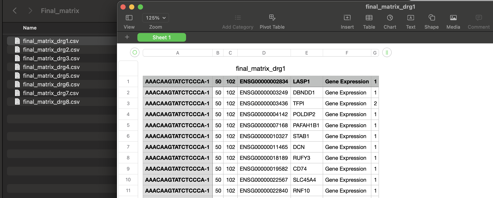
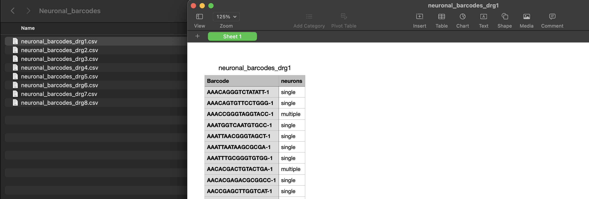
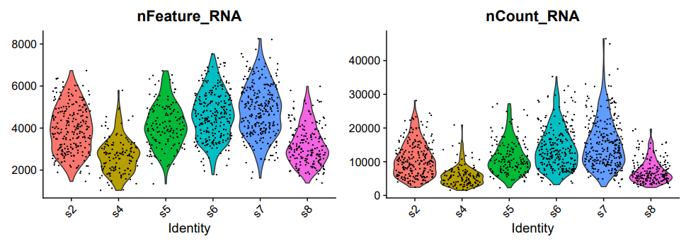
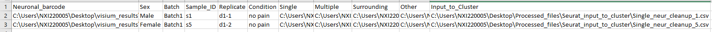
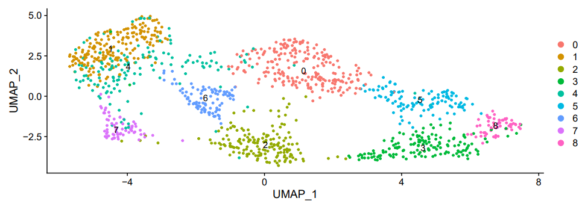

# Visium Spatial Analysis
Visium Spatial Gene Expression is a next-generation molecular profiling solution for classifying tissue based on total mRNA.
The steps involved in classifying the Spatial Gene Expression is done in this tool using `python` and `R`. 

This tool is predominantly used for the analysis of visium spatially resolved RNA-seq data to obtain near single-neuron resolution.
Running the tool is pretty straight forward, however a good understanding of `python` and `R` is recommended. Please familiarize yourself with data types, basic functions, data structures in each language.

## Installation/Setup of Visium Spatial Analysis Tool:
You can install Visium Spatial Analysis tool via git:
```
git clone https://github.com/utdal/visium_spatial_analysis_tool.git
```

## Functionality
#### Visium Spatial Analysis using Python 
1. Fetching *single* and *multiple* neurons.
2. Fetching *surrounding* and *other* barcodes.
3. Generating Quality Control plots(*tsne-plot*).
4. Generating Histogram plots.
5. Removing the barcodes with *low expression*.
#### Clustering workflow using R
1. Generating violin plots.
2. Generating Clusters - [single-cell].

All the methods in this tool are logged, to enable easy debugging.

### How does the input data look like...
This tool requires `Final_matrices` and `Neuronal_barcodes` folders for the analysis. These directories can be stored at a directory level where the analysis data needs to be stored.

There can be any number of *.csv* files in the *Final_matrices* directory, however that should match the respective number of reference Neuronal_barcode .csv's

#### Final_matrices directory:

#### Neuronal_barcodes directory:


---

### Running the Visium Spatial Analysis Tool
There are 2 ways in which one can run this tool, however for both these cases one needs to install the required python packages to a separate python environment. Python environments can be created using conda or manually using python `venv` as shown below, use one of the either ways to create a python environment.

#### 1. Creating python environment using python `venv`
Replace the *path* here and provide an existing path where you want to install this new python environment;
> `python -m venv /path/to/new/virtual/env`

Loading the environment(`venv`) created;
> Windows - `Drive:/path/to/new/virtual/env/activate.bat`
>
> Linux/MacOS - `source /path/to/new/virtual/env/activate`

#### 2. Creating python environment using conda `venv`
Here a new environment called *conda_venv* is created with python version(3.9).
> `conda create -n conda_venv python=3.9`

Loading the conda environment(`conda_venv`) created; 
> `conda activate conda_venv`

#### 3. Installing all the python packages
There is a `requirements.txt` file present at this directory level to set-up all the necessary packages for this tool. One can install all the necessary pakages using the below command;
>  `pip install -r requirements.txt`

#### 4. Running the Tool
Here is an example of how we run the tool;
1. Running the tool using python command-line, once the necessary environment is loaded:
   `python visium_run.py`
2. Using PyCharm, right click and run the file *visium_run.py*

Note: There are 5 functionalities this tool offers, and can be interactively inputted by the user during the runtime.

### Details about each functionality
#### Visium Spatial Analysis using Python 
#### 1. Fetching *single* and *multiple* neurons
This function processes a Final_matrix and a Neuronal_barcode file one-at-a-time for all the file(s) to fetch Single and Multiple(all-neurons) neurons. After processing, the files are saved to the directories under `/Processed_files; "Single" and "Multiple"`.

Inputs needed during this run:
   > - Final_matrix: Directory path to final matrices
   > 
   >   Ex. `/Users/user/Downloads/Final_matrix`

   > - Neuronal_barcodes: Directory path to neuronal barcodes
   > 
   >   Ex. `/Users/user/Downloads/Neuronal_barcodes`

   > - Processed_files: Directory path where the output files should be stored
   > 
   >   Ex. `/Users/user/Downloads`

##### Run:

```
Welcome to visium spatial transcriptomics application ...
-----------------------------------------------

1. Fetch single and multiple neuronal data
2. Fetch surrounding and other barcode data
3. QC and plot tSNE plots
4. Plot histograms based on thresholds
5. Remove barcodes with low expression
-----------------------------------------------

Function call(select a number): 1

1. Fetching single and multiple neurons;
Enter file-path for Final_matrix directory: /Users/user/Downloads/Final_matrix
Enter file-path for Neuronal_barcode directory: /Users/user/Downloads/Neuronal_barcodes
Enter file-path where Processed_files directory needs to be generated: /Users/user/Downloads
Running: final_matrix_drg1.csv -- neuronal_barcodes_drg1.csv
Running: final_matrix_drg2.csv -- neuronal_barcodes_drg2.csv
Running: final_matrix_drg3.csv -- neuronal_barcodes_drg3.csv
Running: final_matrix_drg4.csv -- neuronal_barcodes_drg4.csv
Running: final_matrix_drg5.csv -- neuronal_barcodes_drg5.csv
Running: final_matrix_drg6.csv -- neuronal_barcodes_drg6.csv
Running: final_matrix_drg7.csv -- neuronal_barcodes_drg7.csv
Running: final_matrix_drg8.csv -- neuronal_barcodes_drg8.csv

{'Status': 'Success', 'Response': 'Files generated are saved in the directories: /Users/user/Downloads/Processed_files/Single & /Users/user/Downloads/Processed_files/Multiple'}
```

Here once we run the `visium_run.py` file and selecting the first(1) functionality; one has to provide the `Final_matrices` and `Neuronal_barcodes` directory path's as shown in the above snippet. 

The outputs generated are stored to `Processed_files` directory which is a custom directory which is provided by the user during the run-time.

#### 2. Fetching *surrounding* and *other* barcodes
This function processes a Final_matrix and a Neuronal_barcode file one-at-a-time for all the file(s) to fetch Surrounding and Other barcodes. After processing, the files are saved to the directories under `/Processed_files; "Surrounding" and "Other"`.

Note: In this functionality, an additional `merge` step is executed on the `Multiple` neurons, and `Surrounding` and `Other` barcodes. These merged files are saved to the `/Processed_files` directory.

Inputs needed during this run:
   > - Final_matrix: Directory path to final matrices
   > 
   >   Ex. `/Users/user/Downloads/Final_matrix`

   > - Neuronal_barcodes: Directory path to neuronal barcodes
   > 
   >   Ex. `/Users/user/Downloads/Neuronal_barcodes`

   > - Processed_files: Directory path where the output files should be stored
   > 
   >   Ex. `/Users/user/Downloads`
   
##### Run:   

```
Welcome to visium spatial transcriptomics application ...
-----------------------------------------------

1. Fetch single and multiple neuronal data
2. Fetch surrounding and other barcode data
3. QC and plot tSNE plots
4. Plot histograms based on thresholds
5. Remove barcodes with low expression
-----------------------------------------------

Function call(select a number): 2

2. Fetching surrounding and other data;
Enter file-path for Final_matrix directory: /Users/user/Downloads/Final_matrix
Enter file-path for Neuronal_barcode directory: /Users/user/Downloads/Neuronal_barcodes
Enter file-path where Processed_files directory needs to be generated: /Users/user/Downloads
Running: final_matrix_drg1.csv -- neuronal_barcodes_drg1.csv
Running: final_matrix_drg2.csv -- neuronal_barcodes_drg2.csv
Running: final_matrix_drg3.csv -- neuronal_barcodes_drg3.csv
Running: final_matrix_drg4.csv -- neuronal_barcodes_drg4.csv
Running: final_matrix_drg5.csv -- neuronal_barcodes_drg5.csv
Running: final_matrix_drg6.csv -- neuronal_barcodes_drg6.csv
Running: final_matrix_drg7.csv -- neuronal_barcodes_drg7.csv
Running: final_matrix_drg8.csv -- neuronal_barcodes_drg8.csv
Running: merge on Multiple neuron files, results are saved in /Users/user/Downloads/Processed_files/Seurat_input_to_violin_plots directory.
Running: merge on Other files, results are saved in /Users/user/Downloads/Processed_files/Seurat_input_to_violin_plots directory.
Running: merge on Surrounding files, results are saved in /Users/user/Downloads/Processed_files/Seurat_input_to_violin_plots directory.

{'Status': 'Success', 'Response': 'Files created in /Users/user/Downloads/Processed_files/Other & /Users/user/Downloads/Processed_files/Surrounding'}
```

Here once we run the `visium_run.py` file and selecting the second(2) functionality; one has to provide the `Final_matrices` and `Neuronal_barcodes` directory path's as shown in the above snippet. And, the outputs generated are stored to `Processed_files` directory.

#### 3. Generating Quality Control plots(*tsne-plot*)
This functionality generates tsne plots for Multiple neurons, Surrounding and Other barcode files. This is performed as part of an additional quality control check. This functionality processes the data through **PCA()** to reduce the dimensions to a few best explaining principal component's.

Note: One has to provide the directory path where the `Processed_files` directory is generated. Additionally, one can select **pdf** or **png** for the plots.

Inputs needed during this run:
   > - Processed_files: Directory path where the output files are stored
   > 
   >   Ex. `/Users/user/Downloads`
   
   > - Plot type: The tsne-plot can be generated in a `.pdf` or a `.png` file based on user input
   >  
   >   Ex. `pdf`
   
##### Run:

```
Welcome to visium spatial transcriptomics application ...
-----------------------------------------------

1. Fetch single and multiple neuronal data
2. Fetch surrounding and other barcode data
3. QC and plot tSNE plots
4. Plot histograms based on thresholds
5. Remove barcodes with low expression
-----------------------------------------------

Function call(select a number): 3


3. QC and plotting tSNE plots;
Enter file-path where the Processed_files directory is present: /Users/user/Downloads
Enter plot_type of the tSNE plot to be generated(pdf/png) [png]: pdf
Running for all_neurons_sample_drg1.csv, surrounding_sample_drg1.csv and other_sample_drg1.csv
Running for all_neurons_sample_drg2.csv, surrounding_sample_drg2.csv and other_sample_drg2.csv
Running for all_neurons_sample_drg3.csv, surrounding_sample_drg3.csv and other_sample_drg3.csv
Running for all_neurons_sample_drg4.csv, surrounding_sample_drg4.csv and other_sample_drg4.csv
Running for all_neurons_sample_drg5.csv, surrounding_sample_drg5.csv and other_sample_drg5.csv
Running for all_neurons_sample_drg6.csv, surrounding_sample_drg6.csv and other_sample_drg6.csv
Running for all_neurons_sample_drg7.csv, surrounding_sample_drg7.csv and other_sample_drg7.csv
Running for all_neurons_sample_drg8.csv, surrounding_sample_drg8.csv and other_sample_drg8.csv

{'Status': 'Success', 'Response': "The plot is saved here: ['/Users/user/Downloads/Processed_files/Plots/tSNE_sample_drg1_PdnspsZdHd.pdf', 
                                                            '/Users/user/Downloads/Processed_files/Plots/tSNE_sample_drg2_79IH3AvK2n.pdf', 
                                                            '/Users/user/Downloads/Processed_files/Plots/tSNE_sample_drg3_J4wKbRpZgI.pdf', 
                                                            '/Users/user/Downloads/Processed_files/Plots/tSNE_sample_drg4_fqZpr3c87F.pdf', 
                                                            '/Users/user/Downloads/Processed_files/Plots/tSNE_sample_drg5_uFcrId2ckf.pdf', 
                                                            '/Users/user/Downloads/Processed_files/Plots/tSNE_sample_drg6_ZNqae7VzQj.pdf', 
                                                            '/Users/user/Downloads/Processed_files/Plots/tSNE_sample_drg7_t8gVM3t02W.pdf', 
                                                            '/Users/user/Downloads/Processed_files/Plots/tSNE_sample_drg8_7NFcwBO4kk.pdf']"}

```

#### 4. Generating Histogram plots
This functionality generated histogram plots, for all the *single* and *multiple* neurons, along with *surrounding* and *other* cells.

Note: One has to provide the directory path where the `Processed_files` directory is generated. Additionally, one can set the `upper` and `lower` threshold.

Inputs needed during this run:
   > - Processed_files: Directory path where the output files are stored
   > 
   >   Ex. `/Users/user/Downloads`
   
   > - Upper threshold: An integer value
   >  
   >   Ex. `5000`
   
   > - Low threshold: An integer value, should always be less than upper threshold value
   >  
   >   Ex. `2000`

##### Run:

```
Welcome to visium spatial transcriptomics application ...
-----------------------------------------------

1. Fetch single and multiple neuronal data
2. Fetch surrounding and other barcode data
3. QC and plot tSNE plots
4. Plot histograms based on thresholds
5. Remove barcodes with low expression
-----------------------------------------------

Function call(select a number): 4

4. Plotting histograms based on ceiling and floor thresholds;
Enter file-path where the Processed_files directory is present: /Users/user/Downloads
upper_threshold: 5000
lower_threshold [0]: 2000
Running for single_neurons_sample_drg1.csv, all_neurons_sample_drg1.csv, surrounding_sample_drg1.csv and, other_sample_drg1.csv
Running for single_neurons_sample_drg2.csv, all_neurons_sample_drg2.csv, surrounding_sample_drg2.csv and, other_sample_drg2.csv
Running for single_neurons_sample_drg3.csv, all_neurons_sample_drg3.csv, surrounding_sample_drg3.csv and, other_sample_drg3.csv
Running for single_neurons_sample_drg4.csv, all_neurons_sample_drg4.csv, surrounding_sample_drg4.csv and, other_sample_drg4.csv
Running for single_neurons_sample_drg5.csv, all_neurons_sample_drg5.csv, surrounding_sample_drg5.csv and, other_sample_drg5.csv
Running for single_neurons_sample_drg6.csv, all_neurons_sample_drg6.csv, surrounding_sample_drg6.csv and, other_sample_drg6.csv
Running for single_neurons_sample_drg7.csv, all_neurons_sample_drg7.csv, surrounding_sample_drg7.csv and, other_sample_drg7.csv
Running for single_neurons_sample_drg8.csv, all_neurons_sample_drg8.csv, surrounding_sample_drg8.csv and, other_sample_drg8.csv
{'Status': 'Success', 'Response': "The plot is saved here: ['/Users/user/Downloads/Processed_files/Plots/hist_plot_drg1_2gEqUHR1v3.png', 
                                                            '/Users/user/Downloads/Processed_files/Plots/hist_plot_drg2_RMy34oJe8J.png', 
                                                            '/Users/user/Downloads/Processed_files/Plots/hist_plot_drg3_jPO098cG98.png', 
                                                            '/Users/user/Downloads/Processed_files/Plots/hist_plot_drg4_Rmis4jjNvr.png', 
                                                            '/Users/user/Downloads/Processed_files/Plots/hist_plot_drg5_PhDRMMoMH2.png', 
                                                            '/Users/user/Downloads/Processed_files/Plots/hist_plot_drg6_qQLiOfjZm2.png', 
                                                            '/Users/user/Downloads/Processed_files/Plots/hist_plot_drg7_Fx1CpPpBWr.png', 
                                                            '/Users/user/Downloads/Processed_files/Plots/hist_plot_drg8_F5ksAgqHPq.png']"}
```


#### 5. Removing the barcodes with *low expression*
This functionality removes the barcodes that are lowly expressed, and also apply two additional filters based on filters and thresholds.

Note: Here there are filters and threshold defined as shown in the below snippet.

   > - Processed_files: Directory path where the output files are stored
   > 
   >   Ex. `/Users/user/Downloads`
   
   > - threshold: An integer value
   >  
   >   Ex. `100`
   
   > - filters: filters are basically the proteins being filtered
   >  
   >   Ex. `SNAP25`
   
   > - filter_threshold: filter_threshold is basically the frequency of a particular protein(SNAP25)
   >  
   >   Ex. `1`


##### Run:
```
Welcome to visium spatial transcriptomics application ...
-----------------------------------------------

1. Fetch single and multiple neuronal data
2. Fetch surrounding and other barcode data
3. QC and plot tSNE plots
4. Plot histograms based on thresholds
5. Remove barcodes with low expression
-----------------------------------------------

Function call(select a number): 5                      


5. Removing the low-expressed barcodes;
Enter file-path where Processed_files directory is present: /Users/user/Downloads
threshold [0]: 100
filters(Ex. SNAP25,RLE1) [None]: SNAP25
filter_threshold [0]: 1
Running: single_neurons_sample_drg1.csv
Running: single_neurons_sample_drg2.csv
Running: single_neurons_sample_drg3.csv
Running: single_neurons_sample_drg4.csv
Running: single_neurons_sample_drg5.csv
Running: single_neurons_sample_drg6.csv
Running: single_neurons_sample_drg7.csv
Running: single_neurons_sample_drg8.csv
Running: merge on Single neuron files, results are saved in /Users/user/Downloads/Processed_files/Seurat_input_to_violin_plots directory.
{'Status': 'Success', 'Response': 'Barcodes with low expression are removed successfully.'}
```

#### Output from the python workflow
The output is predominantly .csv files and plots, these files are stored in `/Processed_files` directory provided during the run-time or alternatively also displayed in the `response`, as shown above. This very output is further used in the clustering workflow.

#### Clustering workflow using R
To install all the necessary packages in R (`Seurat`, `ggplot2`, `dplyr`, `future`) run this script; **package_manager.R**. Once the necessary packages are installed, run the **seurat_clustering_wf**. This file has two functions namely `vln_plot_function` and `clustering_function`.

#### 1. Generating violin plots
To generate a violin plot, one has to feed in the *Directory_Path*(output from previous step `/Processed_files/Seurat_input_to_violin_plots`) and a *Project_Name* to the function `vln_plot_function`.
Here is an example of the how to generate violin plots using the function:
> `vln_plot_function("/path/to/Processed_files/Seurat_input_to_violin_plots", "Pig_DRG")`
##### Violin Plot 


#### 2. Generating Clusters - [single-cell]
To generate the clusters, one has to run `clustering_function` function. The input to this function is a `metadata.csv` file.
An example of **metadata.csv** file:
##### 

> Note: The plots and files generated during the analysis are stored in `Seurat_processed_files` folder in the same directory level as `Processed_files`.

##### Clusters


---

### License
License information can be found in the LICENSE file.
